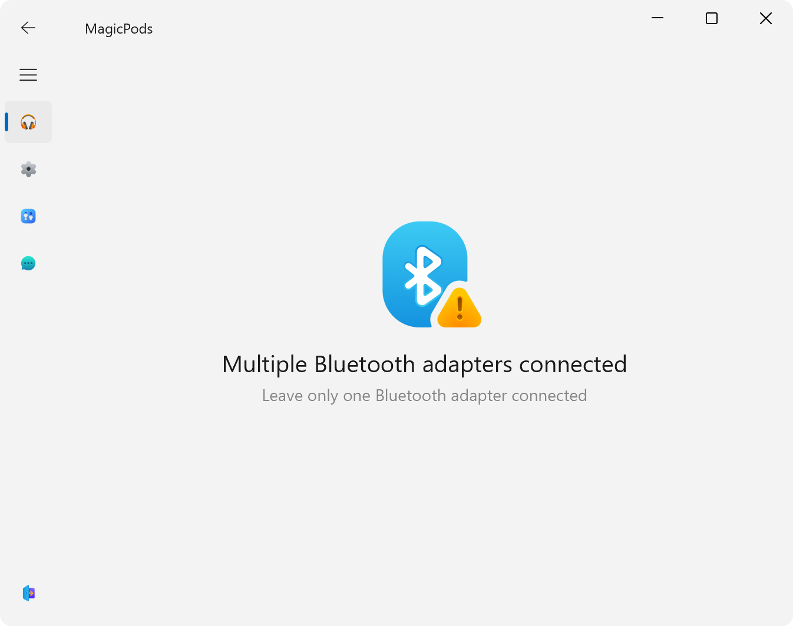
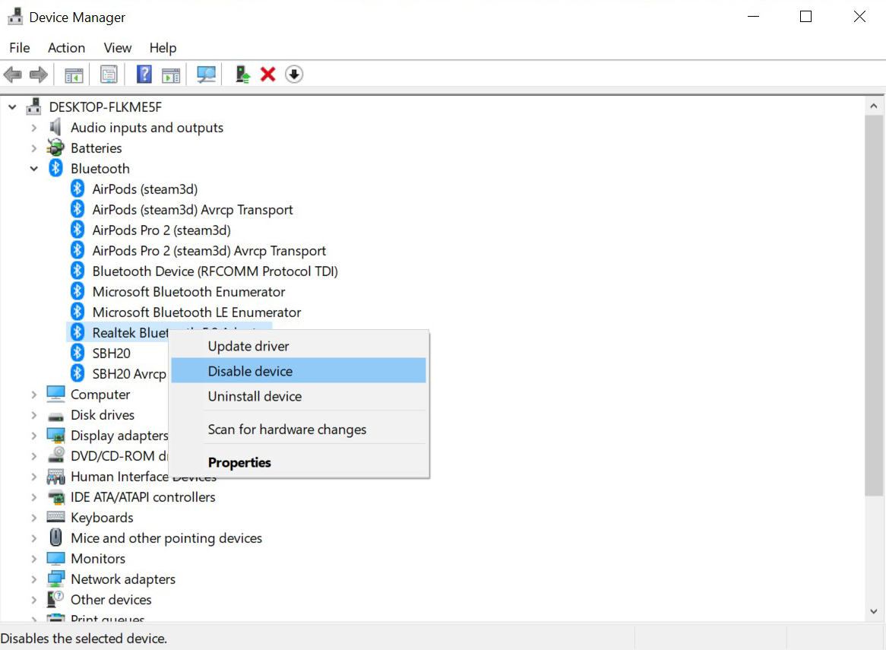

# Bluetooth

MagicPods require a Bluetooth adapter that supports Bluetooth 4.0 or higher to work properly. We recommend updating the Bluetooth driver to the latest version.

## Adapter not found 

Connect Bluetooth adapter.

 

## Multiple adapters connected

Leave only one Bluetooth adapter connected

### Solution

1. Open `Device manager`
2. Disable additional Bluetooth adapters
3. (Optional) Disable additional USB Bluetooth adapters 
4. Restart the application

!!! warning
    If the problem persists after disabling the adapters, write to the mail [MagicPods@outlook.com](mailto:MagicPods@outlook.com).

## Adapter initialization error

Sometimes plugging and unplugging Bluetooth adapter, MagicPods fails to initialize it, just restart the MagicPods.

 

## Classic not supported

 Check the Bluetooth adapter specification. The Bluetooth adapter must support Bluetooth Classic.

!!! note
    If the Bluetooth adapter supports Bluetooth Classic, try updating the Bluetooth driver, then restart the application.

## LE not supported

Check the Bluetooth adapter specification. The Bluetooth adapter must have at least Bluetooth 4.0 support or higher. Additionally, I recommend looking at Bluetooth LE support in the specifications.

!!! note
    If the Bluetooth adapter supports Bluetooth LE and has Bluetooth version 4.0 or higher, try updating the Bluetooth driver, then restart the application.

