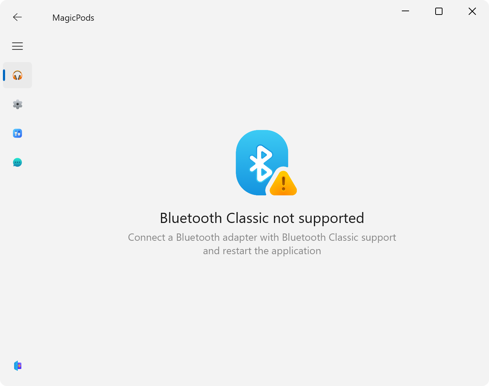

Check the Bluetooth adapter specification. The Bluetooth adapter must support Bluetooth Classic.

!!! note
    If the Bluetooth adapter supports Bluetooth Classic, try updating the Bluetooth driver, then restart the application.

