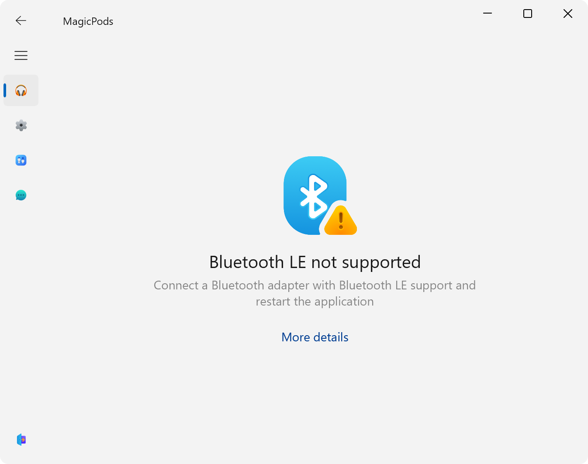

Check the Bluetooth adapter specification. The Bluetooth adapter must have at least Bluetooth 4.0 support or higher. Additionally, I recommend looking at Bluetooth LE support in the specifications.

!!! note
    If the Bluetooth adapter supports Bluetooth LE and has Bluetooth version 4.0 or higher, try updating the Bluetooth driver, then restart the application.

