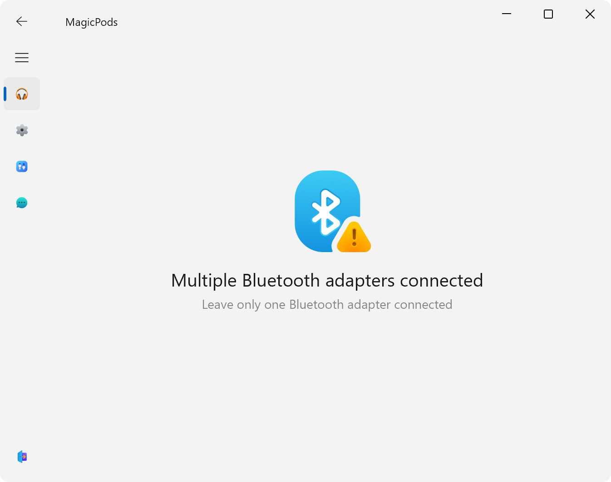
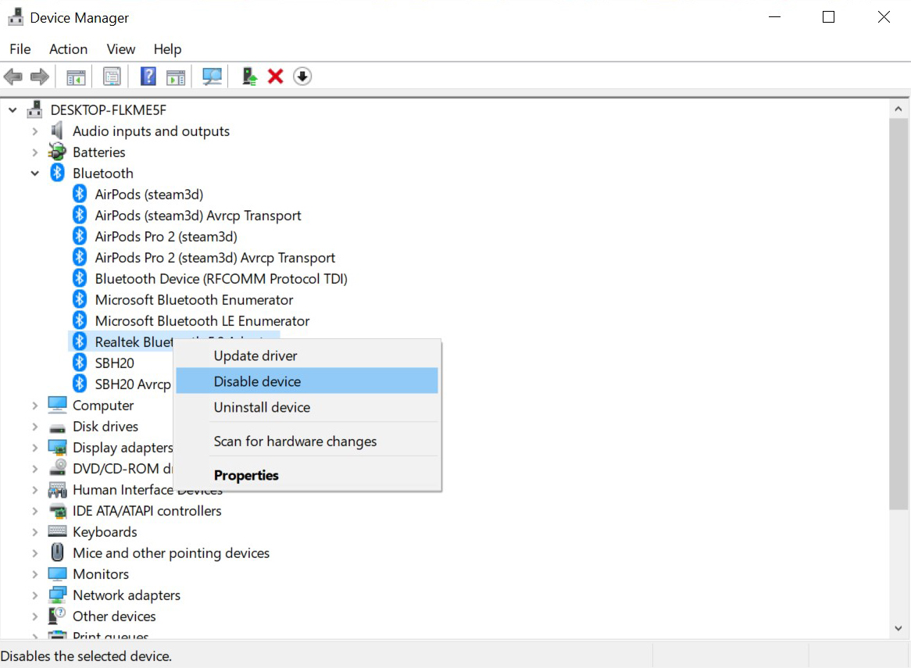

Leave only one Bluetooth adapter connected

### Solution

1. Open `Device manager`
2. Disable additional Bluetooth adapters
3. (Optional) Disable additional USB Bluetooth adapters 
4. Restart the application

!!! warning
    If the problem persists after disabling the adapters, write to the mail [MagicPods@outlook.com](mailto:MagicPods@outlook.com).