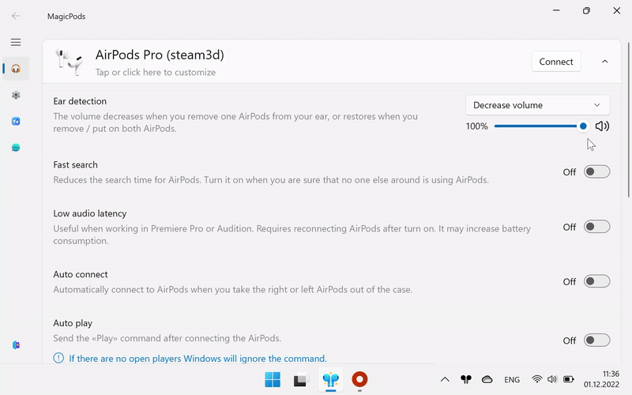

## Ear detection

Allows you automatically pause and resume playing media content and decrease volume when you remove and insert the earbud into your ear.

| Option                                | Description                                                                                                                                 |
| ------------------------------------- | ------------------------------------------------------------------------------------------------------------------------------------------- |
| Play / Pause                          | Pauses playback when one earphone is removed and vice versa. Playback will not resume if both earbuds are removed for more than 60 seconds. |
| Decrease volume                       | Decreases the volume when one earphone is removed and vice versa. The volume also will be restored if both earphones are removed.           |
| Both (Decrease volume + Play / Pause) | Both the `Play/Pause` and `Decrease Volume` actions will be used simultaneously.                                                            |
| Disabled                              | Ear Detection disabled                                                                                                                      |

Ear Detection supports multiple headphone connections. You can connect AirPods and AirPods Max at the same time.

For instance, if you are listening to music with AirPods and remove both earbuds, the playback will pause. If you then put on AirPods Max, the playback will automatically resume.

!!! Tip
    Set `Auto switch audio output` to switch to the speakers when the headphones are removed.

### Available media players

Ear Detection supports all players with system media control:

The following players are additionally supported:

* VLC
* QQMusic
* CloudMusic
* KuGou
* iTunes (Microsoft Store)
* AIMP
* Winamp
* KMPlayer
* PotPlayer
* MPV

!!! note
    Sometimes KuGou media player doesn't react on Play / Pause command. Restart KuGou can fix this.

### Set decrease volume

Set the percentage to which the current volume will be reduced.

> For example the headphone volume is 50 and the percentage to which volume will be reduced is 25%. Then when you remove one headphone from your ear the volume will be `50 * (25 / 100) = 12.5` 

