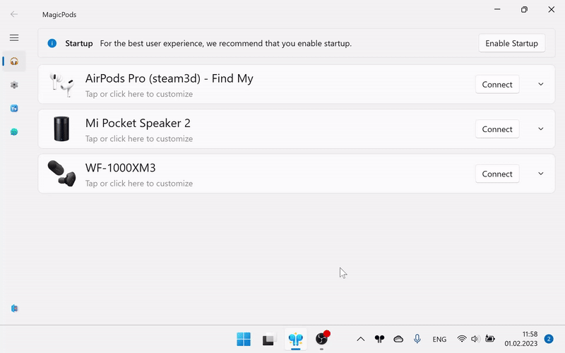

## Show battery percentage

Allows you to get the charge level using Handsfree profile. This method is suitable for most unsupported headphones. The accuracy of the charge level depends on the headphones.

> As long as this feature is enabled, the voice communication will be unavailable, you could not make the calls in applications like Skype, Discord and, etc using the headphone microphone.

| Option | Description                                                                                                  |
| ------ | ------------------------------------------------------------------------------------------------------------ |
| On     | Restart MagicPods to apply changes. After restart will be available extra option `Low battery notification`. |
| Off    | Restart MagicPods to apply changes.                                                                          |

!!! warning
    - Sometimes the charge level may not be displayed, try reconnecting the headphones. 
    - The headphones may disappear from the sound out list for 5-10 seconds.

##### Tested on headphones

1. Xiaomi AirDots
2. WF-1000XM3 

### Battery is not displayed

Check whether Handsfree is enabled in the settings

1. Open `Control panel`
2. Right click on `Devices and Printers` and choose `Open`
3. Select your headphones and check the `Handsfree Telephony` turned on.

