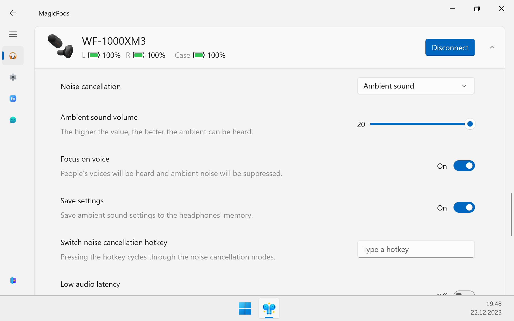

## Noise cancelling

The settings work similarly to the official app [Sony Headphones](https://play.google.com/store/apps/details?id=com.sony.songpal.mdr).

!!! note
    Before you start, connect your headphones.

| Option             | Description                   |
| ------------------ | ----------------------------- |
| Noise cancellation | —                             |
| Wind cancellation  | —                             |
| Ambient sound      | Additional settings available | 
| Off                | —                             |

### Ambient sound

The ambient sound has additional settings.

#### Ambient sound volume

The higher the value, the better the ambient сап be heard. 

#### Focus on voice

People's voices will be heard, and ambient noise will be suppressed. 

#### Save settings 

The `Ambient sound volume` and `Focus on voice` settings will be stored in the headphone memory (Existing settings will be overwritten).

> When you connect headphones to another device and turn on Ambient sound, the settings you set in MagicPods will be used.