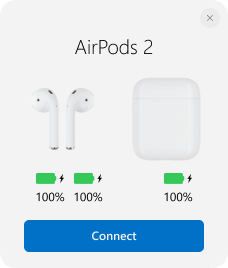
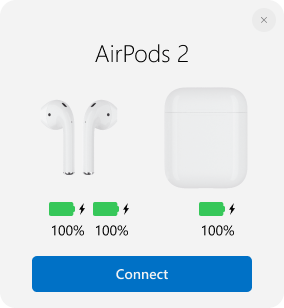
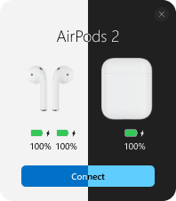

# Pop-up window

## Show window

Show or hide pop-up window like on iPhone, when you open the case. 

### Windows size

Customize the size of pop-up window.

View | Setting
:-- | :-- 
 | Small
 | Medium
 | Large

### Windows position

Customize from which side of the screen pop-up window will appear.

View | Setting
:-- | :-- 
 | Top left corner
 | Top right corner
 | Center top
 | Center
 | Center bottom
 | Bottom left corner
 | Bottom right corner

### Windows Theme

Customize theme of pop-up window.

View | Setting
:-- | :-- 
 | Light
 | Dark
 | Use system theme

### AirPods Search Radius

If you have trouble with popup window it does not appear or randomly appears you need setup the AirPods search radius.

1. Turn on Bluetooth
2. Open `General settings` in the MagicPods app
3. Slide AirPods search radius slider to 0
4. Open your case with AirPods inside near your pc and slowly slide the slider to the right until a popup window appears
5. If popup window not always appears slide the slider on one step to the right

!!! tip
    In addition, over time, the application can most suggest optimal settings.

### Show window for fake AirPods

Show or hide pop-up window for fake AirPods if they are in the list of Bluetooth devices.

> Fake AirPods does not provide battery information while displaying the popup.