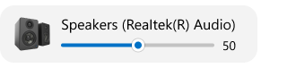
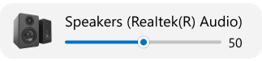
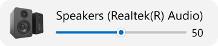
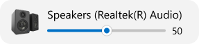
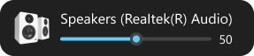
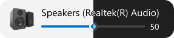

# Sound output

## Show window

Show pop-up window when sound output changed.

### Adjust volume

- Drag the slider to the left or to the right
- Hover your mouse over the pop-up window and scroll the mouse wheel

### Window size

Customize the size of pop-up window.

View | Setting
:-- | :-- 
 | Small
 | Medium
 | Large

### Window position

Customize from which side of the screen pop-up window will appear.

View | Setting
:-- | :-- 
 | Top left corner
 | Top right corner
 | Center top
 | Center
 | Center bottom
 | Bottom left corner
 | Bottom right corner

### Window Theme

Customize theme of pop-up window.

View | Setting
:-- | :-- 
 | Light
 | Dark
 | Use system theme

## Switch sound output hotkey

Pressing the hotkey cycles through the sound outputs.