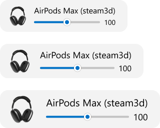
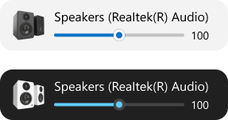

Show pop-up window when sound output changed.

## Adjust volume

- Drag the slider to the left or to the right
- Hover your mouse over the pop-up window and scroll the mouse wheel

## Windows size

Customize the size of pop-up window.

- Small
- Medium
- Large

## Windows position

Customize from which side of the screen pop-up window will appear.

- Top left corner 
- Top right corner 
- Center top 
- Center 
- Center bottom 
- Bottom left corner 
- Bottom right corner 

## Windows Theme
Customize theme of pop-up window.

- Light
- Dark
- Use system theme

