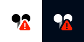

## Hide icon

Hide the icon in the system tray.

> MagicPods will continue to run in the background. To close the application, use the "Close MagicPods" button.

## Show battery percentage

Displays the average battery percentage of connected headphones. To find out the charge level for the left and right earbuds separately, hover over the tray icon.

| Option | Icon                                            | Description                                                                                                                        |
| ------ | ----------------------------------------------- | ---------------------------------------------------------------------------------------------------------------------------------- |
| On     |  | The icon displays the charge level of the headphones or the last connected headphones (if more than two headphones are connected). |
| Off    |               | The icon displays a small indication that the headphones are connected.                                                            |

> The left earbud has 25%, and the right earbud 45%. The icon will display a battery level of 35%.

### Style

| Option | Icon                                            | Description                                                             |
| ------ | ----------------------------------------------- | ----------------------------------------------------------------------- |
| Text   |          | The icon in the system tray displays the charge level as a number       |
| Icon   |  | The icon in the system tray displays the charge level as a battery icon |

### Text style

Additional settings when the `Text` style is selected.

#### Font

| Option        | Description                                                                                                                   |
| ------------- | ----------------------------------------------------------------------------------------------------------------------------- |
| Dropdown list | Select a font from the dropdown list to display the battery level on the tray icon. The default font is Microsoft Sans Serif. |

#### Font size

| Option | Description                                                                                     |
| ------ | ----------------------------------------------------------------------------------------------- |
| Number | Select the font size for displaying the battery level on the tray icon. The default size is 16. |

#### Light theme

| Option                                       | Hex color | Description                                                                                                                                                     |
| -------------------------------------------- | --------- | --------------------------------------------------------------------------------------------------------------------------------------------------------------- |
|    | #000000   | Text icon color (Windows theme is set to light).                                                                                                                |
|  | #9D5D00   | Text icon color when the battery is charging (Windows theme is set to light).                                                                                   |
|     | #C42B1C   | Text icon color when low battery. You can set the low battery level individually for each headphone in the headphones settings (Windows theme is set to light). |

#### Dark theme

| Option                                       | Hex color | Description                                                                                                                                                    |
| -------------------------------------------- | --------- | -------------------------------------------------------------------------------------------------------------------------------------------------------------- |
|    | #FFFFFF   | Text icon color (Windows theme is set to dark).                                                                                                                |
|  | #FCE100   | Text icon color when the battery is charging (Windows theme is set to dark).                                                                                   |
|     | #FF99A4   | Text icon color when low battery. You can set the low battery level individually for each headphone in the headphones settings (Windows theme is set to dark). |

### Analog style

Additional settings when the `Analog` style is selected.

#### Light theme

| Option                                        | Hex color | Description                                                                                                                                                          |
| --------------------------------------------- | --------- | -------------------------------------------------------------------------------------------------------------------------------------------------------------------- |
|    | #000000   | Icon color (Windows theme is set to light).                                                                                                                          |
|    | #000000   | Icon indicator color (Windows theme is set to light).                                                                                                                |
|  | #9D5D00   | Icon indicator color when the battery is charging (Windows theme is set to light).                                                                                   |
|     | #C42B1C   | Icon indicator color when low battery. You can set the low battery level individually for each headphone in the headphones settings (Windows theme is set to light). |

#### Dark theme

| Option                                        | Hex color | Description                                                                                                                                                         |
| --------------------------------------------- | --------- | ------------------------------------------------------------------------------------------------------------------------------------------------------------------- |
|    | #FFFFFF   | Icon color (Windows theme is set to dark).                                                                                                                          |
|    | #FFFFFF   | Icon indicator color (Windows theme is set to dark).                                                                                                                |
|  | #FCE100   | Icon indicator color when the battery is charging (Windows theme is set to dark).                                                                                   |
|     | #FF99A4   | Icon indicator color when low battery. You can set the low battery level individually for each headphone in the headphones settings (Windows theme is set to dark). |

#### Single battery icon

| Option | Icon                                            | Description                                                                                                                              |
| ------ | ----------------------------------------------- | ---------------------------------------------------------------------------------------------------------------------------------------- |
| On     |  | The average battery level of the left and right earbuds is displayed, or a single battery level if the headphones have only one battery. |
| Off    |      | The icon switches between a single battery icon and separate left and right battery icons based on the headphones' functionality.        |

## Display sound output change

The icon becomes transparent when the audio output is changed to the computer speakers. 

### Opacity
| Option | Description                                            |
| ------ | ------------------------------------------------------ |
| 0-100% | Adjusts the level of opacity applied to the tray icon. |

## Tray icons

Icon | Description
:-: | :-- 
 | Bluetooth off
 | Headphones are disconnected
 | Windows is connecting to or disconnecting headphones.
 | Headphones connected 
 | MagicPods is searching for AirPods
 | Bluetooth adapter not found
 | Warning message (Hover the icon to get details or open MagicPods)
 | Error message (Hover the icon to get details or open MagicPods)
 | An unexpected error has occurred (Hover the icon to get details)
 | Analog icon of a single battery for headphones
 | Analog icon of left and right batteries for headphones
 | Analog icon for the left battery for headphones (AirPods only)
 | Analog icon for the right battery for headphones (AirPods only)
 | Analog icon of a single charging battery for headphones
 | Analog icon of left and right charging batteries for headphones
 | Analog icon of a single low battery for headphones
 | Analog icon of left and right low batteries for headphones
 | Digital icon of a battery for headphones
 | Digital icon of a charging battery
 | Digital icon of low battery for headphones

## Tray icon hover tooltip

Tooltip | Description
:-: | :-- 
 | Battery level of AirPods from two earbuds.
 | Battery level of AirPods from one earbud.

Symbol `•` indicates that the earbud is charging.