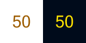

## Hide icon

Hide the icon in the system tray.

> MagicPods will continue to run in the background. To close the application, use the "Close MagicPods" button.

## Show battery percentage

Displays average battery percentage of connected headphones. To find out the charge level for the left and right earbuds separately, hover over the tray icon.

| Option | Icon                                      | Description                                                                                                                        |
| ------ | ----------------------------------------- | ---------------------------------------------------------------------------------------------------------------------------------- |
| On     |  | The icon displays the charge level of the headphones or the last connected headphones (if more than two headphones are connected). |
| Off    |         | The icon displays a small indication that the headphones are connected.                                                            |

> The left earbud has 25% and the right earbud 45%, the icon will display battery level 35%. 

### Style

| Option | Icon                                      | Description                                                         |
| ------ | ----------------------------------------- | ------------------------------------------------------------------- |
| Text   |    | The icon in system tray displays the charge level as a number       |
| Icon   |  | The icon in system tray displays the charge level as a battery icon |

## Tray icons

Icon | Description
:-: | :-- 
 | Bluetooth off
 | Headphones are disconnected or connected headphones do not support showing battery
 | Windows is connecting / disconnecting to headphones 
 | Headphones connected 
 | MagicPods is searching AirPods
 | Bluetooth adapter not found
 | Warning message (Hover the icon to get details or open MagicPods).
 | Error message (Hover the icon to get details or open MagicPods).
 | An unexpected error has occurred (Hover the icon to get details).
 | Analog battery (Charge between 100%-66%)
 | Analog battery (Charge between 66%-33%)
 | Analog battery (Charge between 33%-10%)
 | Analog battery (Charge between 10%-0%)
 | Analog battery (Battery is charging)
 | Digital battery (Current charge)
 | Digital battery (Charge between 33%-0%)
 | Digital battery (Battery is charging)

## Tray icon hover tooltip

Tooltip | Description
:-: | :-- 
 | Charge for AirPods from two earbuds
 | Charge for AirPods from one earbud

Symbol `•` indicates that the earbud is charging.