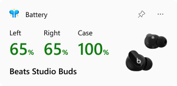
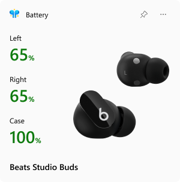

# Widgets

Widgets are supported on Windows 11 to enable, open the widgets board, click on the plus sign and select MagicPods.

## Battery widget

Click on the 3 dots in the upper right corner and select the desired size.

| Option | Preview                              |
| ------ | ------------------------------------ |
| Small  |   |
| Medium |  | 

### The widget is not pinned or displayed

Occurs when the widget board hangs.

1. Open Task Manager
2. Terminate the `Widgets.exe`
3. Open the widget board 