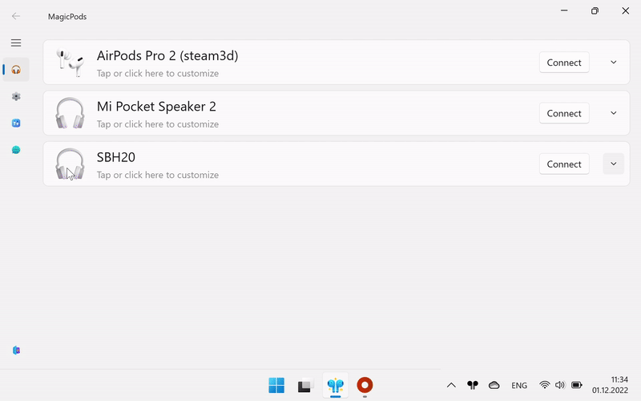
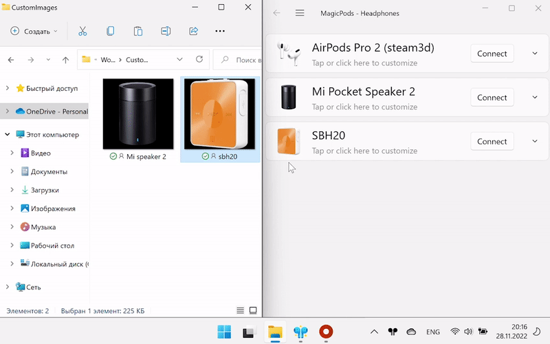

You can change the headphones image in the following ways:

> Images in `png` format with resolution `512x512px` are supported. Higher resolution images will automatically compressed to 512x512px on the larger side of the image.

### Method 1

1. Right-click on headphones image
2. Select `Change image` from the dropdown menu
3. Choose a new image

### Method 2

1. Open File Explorer with required `*.png` images
2. Drag'n'drop the selected image from File Explorer onto headphones image

!!! note
    Sometimes some images cannot be processed, in which case the images will not be modified. Try resaving the image in a graphics editor or change its resolution slightly. We recommend using the headphones image on transparent background.

## Restore image

You can restore the headphones image in the following way:

1. Right-click on headphones image
2. Select `Restore image` from the dropdown menu

