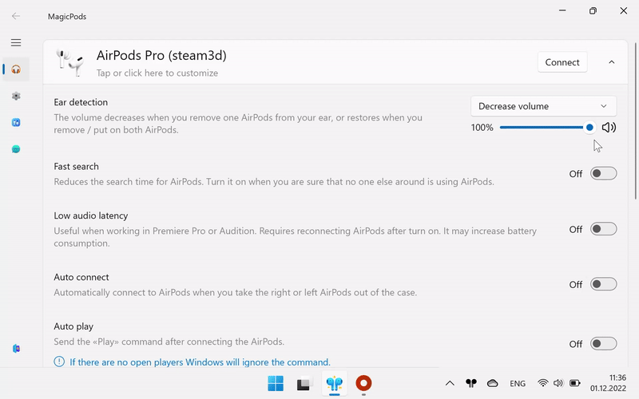

Some headphone models support Ear Detection which allows you to automatically pause and resume playing media content when you remove and insert the earphone into your ear.

## Play / Pause

Description:

1. Insert both headphones in ears to activate Ear Detection
2. Remove one headphone from your ear to pause playback
3. Insert the one headphone back into your ear to resume playback
4. Remove both headphones from your ears to pause playback. MagicPods will wait 60 seconds, after this time the Ear Detection feature will be deactivated. Repeat `Step 1` to activate Ear Detection 

> For full size headphones, steps 2 and 3 are skipped.

Ear Detection supports multiple headphone connections. You can connect AirPods and AirPods Max at the same time. For example, you listened to music using AirPods and removed both headphones from your ears, playback will be paused if you then put on AirPods Max, playback will automatically resume.

!!! Tip
    If you are using headphones that support `Auto switch audio output`, the above example will also automatically switch audio output. Do not forget to enable the `Auto switch audio output` feature.

### Available media players

Ear Detection supports all players with system media control:

The following players are additionally supported:

* VLC
* QQMusic
* CloudMusic
* KuGou
* iTunes (Microsoft Store)
* AIMP
* Winamp
* KMPlayer
* PotPlayer
* MPV

!!! note
    Sometimes KuGou media player doesn't react on Play / Pause command. Restart KuGou can fix this.

## Decrease volume 

Set the percentage to which the current volume will be reduced.

> For example the headphone volume is 50 and the percentage to which volume will be reduced is 25%. Then when you remove one headphone from your ear the volume will be `50 * (25 / 100) = 12.5` 

Description:

1. Insert both headphones in ears to activate Ear Detection
2. Remove one headphone from your ear to decrease volume
3. Insert the one headphone back into your ear to restore volume
4. When both headphones are out of ear the volume is restored.Repeat `Step 1` to activate Ear Detection

> For full size headphones, steps 4 is skipped.

## Both (Decrease volume + Play / Pause)

The both actions `Play / Pause` and `Decrease volume` will be used at the same time.

## Disabled

Feature Ear Detection disabled