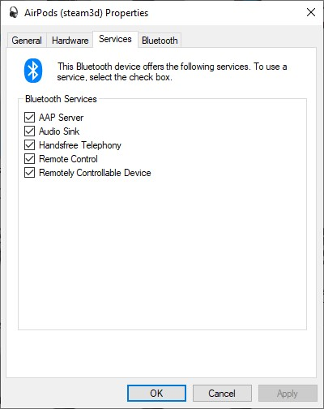
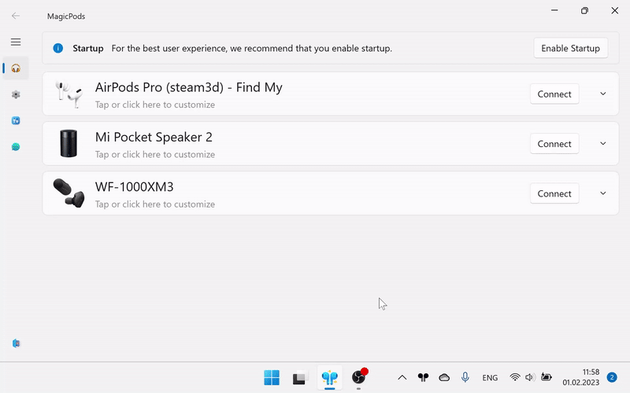

# Show battery percentage

!!! note
    For AirPods and Beats headphones this feature is missing, because the battery information available by default for those headphones.

Many headphones can provide battery information. MagicPods can try to get the charge level from such headphones.

During showing battery, the voice communication will be unavailable, you could not make the call in applications like Skype, Discord and etc.

> To restore voice communication, turn off `Show battery percentage` and reconnect headphones.

## Prepare headphones

Before turning on `Show battery percentage` be sure that Hands-free service enabled.

1. Open `Control panel`
2. Right click on `Devices and Printers` and choose `Open`
3. Select your headphones and check the `Handsfree Telephony` turned on.

## Enable

Turn on the toggle switch to showing battery charge of selected headphones. Restart MagicPods to apply changes.

After restart will be available extra option [Low battery notification](headphones-low-battery-notification.md).

Connect headphones, after 0-15 second MagicPods will show current battery charge. Some headphones can provide a battery charge with accurate 1%, other with accurate 10%.

> Be patient Windows does no like when you very fast connect and disconnect headphones.

!!! warning
    Sometimes the charge level is not displayed first time, you need to reconnect the headphones. Some headphones can reconnect itself or stuck in connect / disconnect loop. When connect second headphones, the both headphones may disappear from the sound out list. They appear again after 0-10 seconds.  Be aware that experimental features may be removed from the app.

### Tested on headphones

1. Xiaomi AirDots
2. WF-1000XM3 

## Disable

Disconnect headphones. Turn off the toggle switch. Restart MagicPods to apply changes.