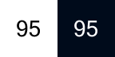
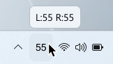

## Tray icons
!!! note
    When AirPods (left and right) connected the icon shows the average battery value. Example: Left AirPod has 25% and Right AirPod 45%, the MagicPods will show battery level 35%

Icon | Description
:-: | :-- 
 | AirPods disconnected
 | Windows is connecting to AirPods 
 | MagicPods is searching AirPods
 | An error has occurred (Hover the icon to get details).
 | Analog battery (Charge between 100%-66%)
 | Analog battery (Charge between 66%-33%)
 | Analog battery (Charge between 33%-10%)
 | Analog battery (Charge between 10%-0%)
 | Analog battery (Battery is charging)
 | Digital battery (Current charge)
 | Digital battery (Low battery between 33%-0%)
 | Digital battery (Battery is charging)

!!! tip
    You can change battery style in MagicPods settings.

## Tray icon hover tooltip

Tooltip | Description
:-: | :-- 
 | Charge for AirPods from two earbuds
 | Charge for AirPods from one earbud

Symbol `•` indicates that the earbud is charging.

## Live tile icons
!!! tip
    To enable live tile battery info pin the MagicPods app to start menu. Make sure that you turn on live tile (Right click on tile -> more -> Turn live tile on).

### Both AirPods connected (Include AirPods Max)

Icon | Description
:-: | :-- 
 | Charge between 100%-66%
 | Charge between 66%-33%
 | Charge between 33%-10%
 | Charge between 10%-0%
 | Battery is charging

### Only left AirPod connected

Icon | Description
:-: | :-- 
 | Charge between 100%-66%
 | Charge between 66%-33%
 | Charge between 33%-10%
 | Charge between 10%-0%
 | Battery is charging

### Only right AirPod connected

Icon | Description
:-: | :-- 
 | Charge between 100%-66%
 | Charge between 66%-33%
 | Charge between 33%-10%
 | Charge between 10%-0%
 | Battery is charging
