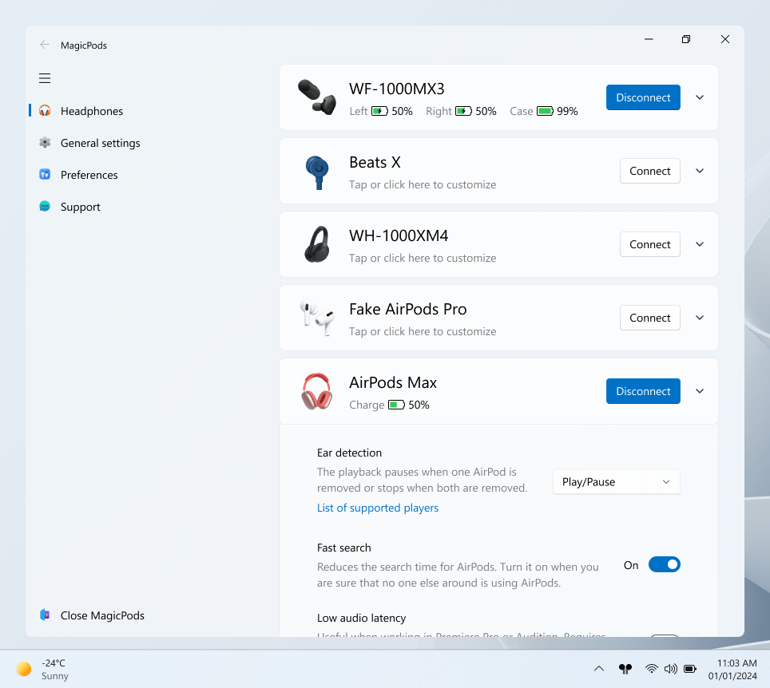
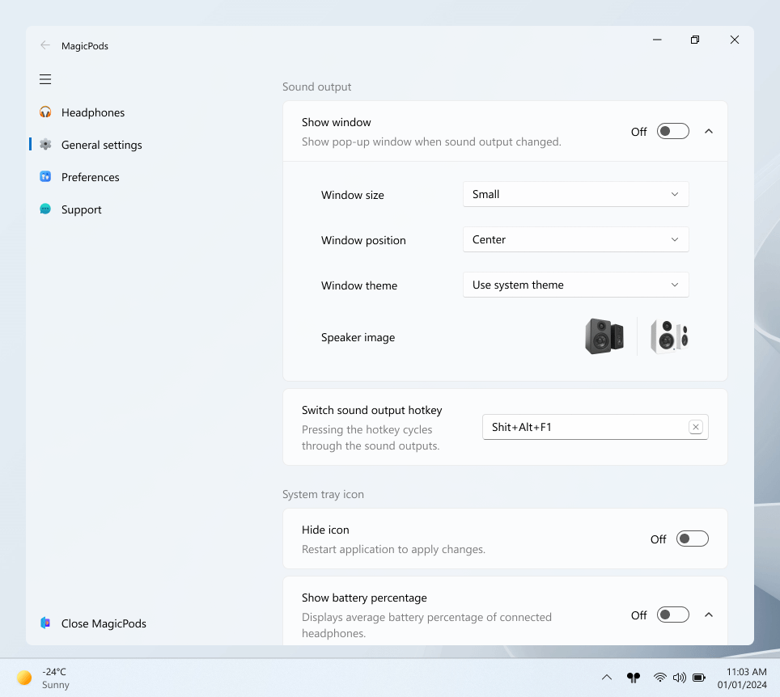
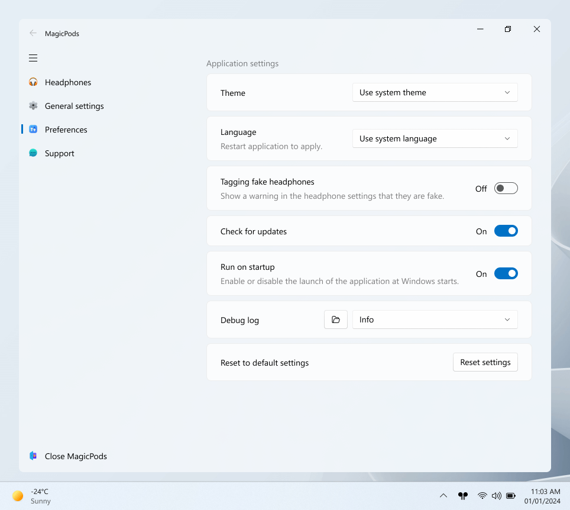
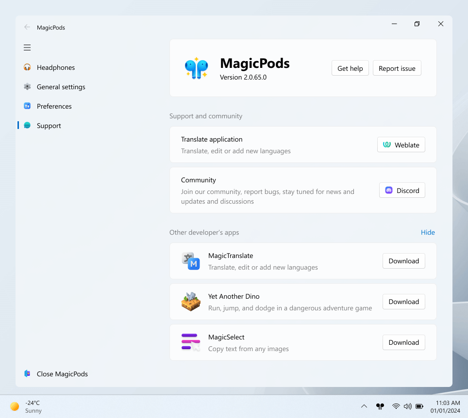
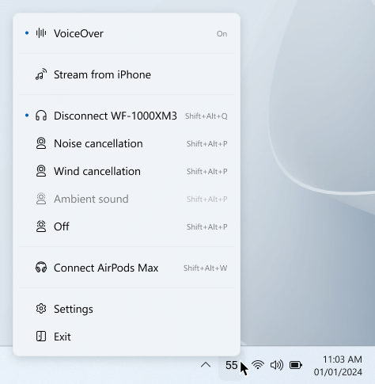

# Getting Started with MagicPods

[The MagicPods](https://magicpods.app/) — hub for your Bluetooth headphones.

## Using MagicPods

The application includes several useful features, such as battery level indicators, handy connectivity, narrator reading out notifications, audio streaming from your mobile device, sound output switching, hotkeys, and additional capabilities.

Support for Windows 10 and 11 features such as live tiles and widgets. Windows 11-inspired design, support for themes and multiple languages.

All features are grouped by page.  Detailed descriptions can be found in the table of contents on the left.

> Please note, some settings have additional nested parameters and have a `⮟ downward` or `⮝ upward` on the right side of them.

### Headphones

A list of all your Bluetooth headphones and their individual settings.

Information regarding supported headphones and their available functions can be found in the `Headphones` section of the left-hand table of contents.

> To add headphones, simply pair them with Windows via Bluetooth Settings, to remove headphones, remove them via Bluetooth Settings.

### General settings

Additional non-headphone features and system tray icon customization.

### Preferences

App settings from theme to checking for updates

### Support

More information about MagicPods work, community, bug report and other applications by the author.

### System tray icon

The system tray icon can be used for quick actions. The items in the context menu are dependent on the enabled functions and headphones. Refer to the [System tray icon](fun-tray-icon.md) to customize the icon.

## Tips

1. Disabling the Handsfree profile will speed up headphone connections
2. Disabling app logs slightly reduces CPU and disk usage

## Translation

Follow the [translation instructions](translate.md) provided to correct translation errors or to add your own language to MagicPods.

## Other Apple headphones

If you have Apple headphones that are not supported, please contact [Discord](https://discord.com/invite/UyY4PY768V) or refer to [Help with supports new headphones](https://github.com/steam3d/MagicPods-Windows/issues/21) to submit a request for them to be added.

## Getting help

To get help with MagicPods, please use the [Discord](https://discord.com/invite/UyY4PY768V).

