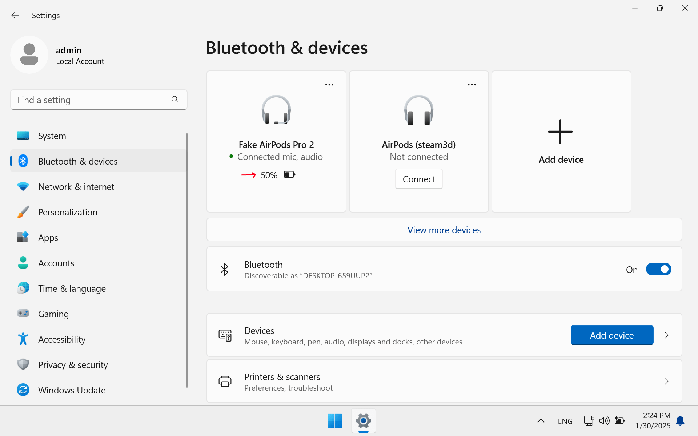
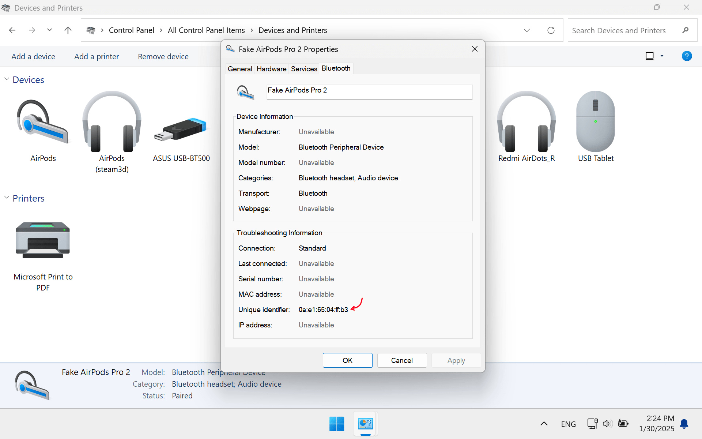
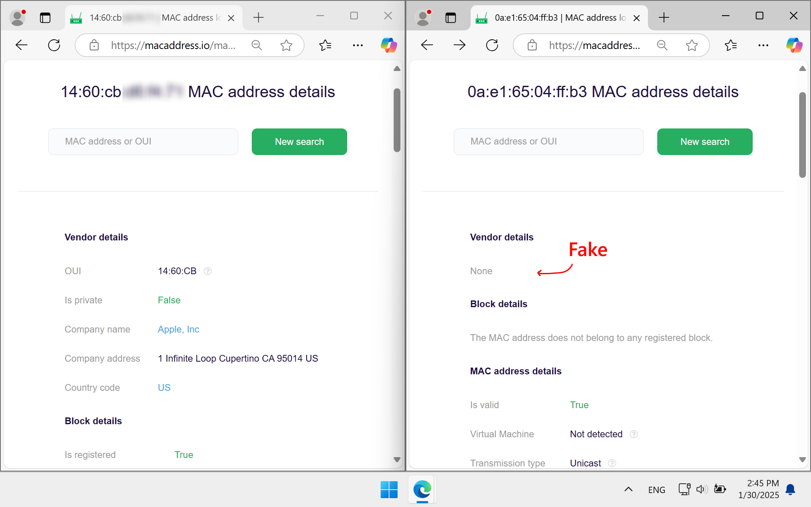

# How to Identify Fake AirPods

These methods will help determine whether AirPods are fake.

## 1. Check the battery indicator in Windows settings

The battery level on original AirPods is not displayed in Windows settings, nor on Android devices. If the battery level is shown, the headphones are likely fake.

1. Open `Windows settings`.
2. Go to the `Bluetooth & Devices section`.
3. Connect the AirPods and check if the battery level is displayed.

## 2. Check the ear detection in Windows

Ear detection does not and should not work on Windows and Android. If media playback pauses when you remove an AirPod from your ear, the headphones are likely fake.

## 3. Check the MAC address

Major Bluetooth device manufacturers reserve certain MAC addresses for themselves. Fakes never use these addresses.

To check the Bluetooth MAC address of your headphones:

1. Go to the `Control Panel`.
2. Right-click on `Devices and Printers` and select `Open`.
3. Right-click on the name of your AirPods and select `Properties`, then go to the `Bluetooth` tab.
4. Copy the `Uwnique identifier` (Bluetooth MAC address).
5. Go to the website [macaddress.io](https://macaddress.io), paste the Bluetooth MAC address, and check it.

If the headphones are original, you will see information about the device manufacturer. If they are fake, no manufacturer information will be displayed.

