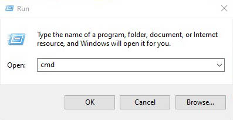
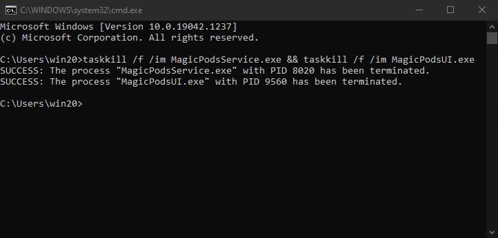

# AirPods status not updating

The application may be stuck and unable to receive new data. This can happen for many reasons, such as your own power, audio, bluetooth settings and etc.

### Solution
Just restart the MagicPods.

1. Close the MagicPods window if open.
2. Open console (Press `win + r` and write `cmd` and press `OK`).

    

3. Past this command into console and press enter:

    `taskkill /f /im MagicPodsService.exe && taskkill /f /im MagicPodsUI.exe`
    
    

4. Run the MagicPods