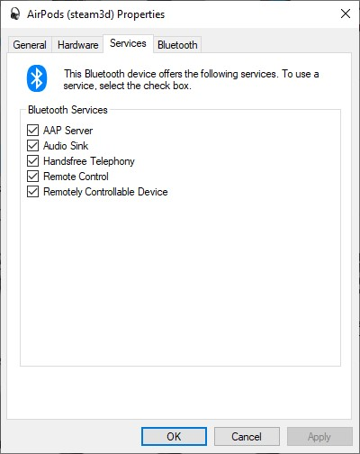

# Connectivity issues

Sometimes when you use connect to AirPods option on MagicPods your AirPods settings could set wrong. For example, when you close the app when it tries to connect to AirPods or when it crushes.

So, if your AirPods doesn't have sound or you can't connect to them manually through Bluetooth settings you need to do these steps:

1. Close the MagicPods app
2. Go to `Control Panel` -> `Devices and Printers`
3. Right click to your `AirPods name` -> `Properties` -> Tab `Services`
4. Enable all checkboxes on this tab
5. Reboot your computer

!!! note
    The MagicPods uses only 2 services Audio Sink and HandsFree Telephony.