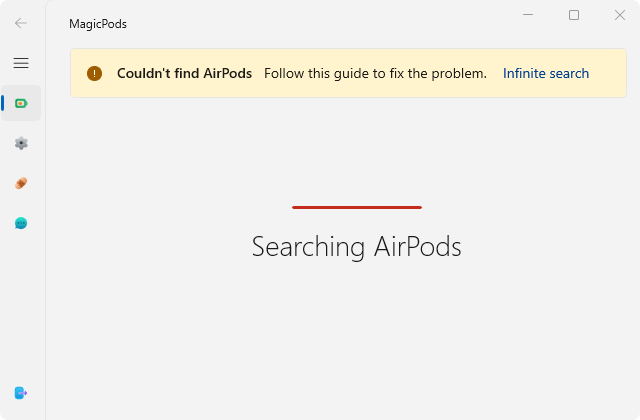
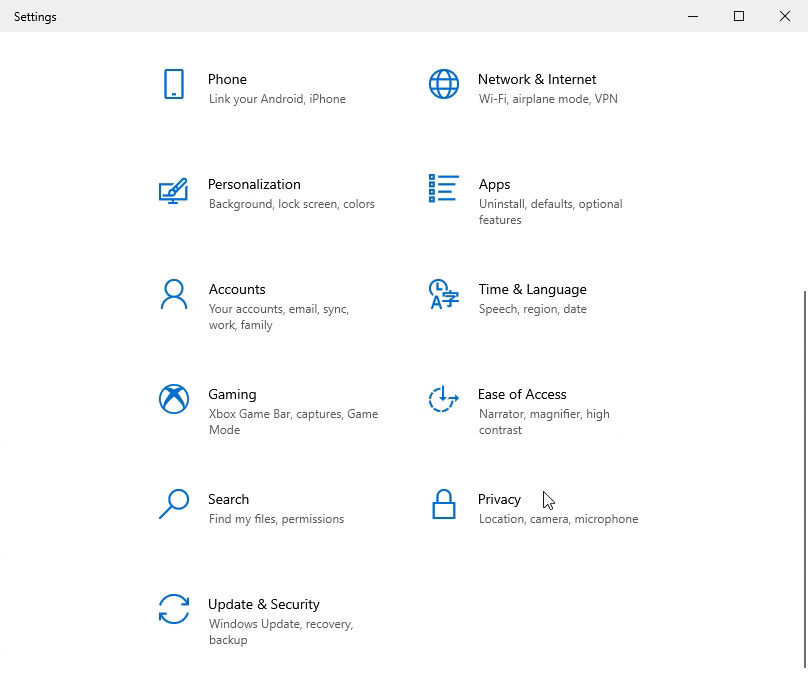

# Infinite search

!!! tip
    Ignore this warn notification if MagicPods is working normally or [report](report-issue.md) accidental notification.

In most cases, this error occurs because the Windows-managed Bluetooth adapter fails to send data to MagicPods.

Based on user feedback, the following reasons have been identified:

- Corrupted system files
- Windows update that caused issues
- Bluetooth driver update that caused issues
- Incorrect Windows settings, often after using optimization tools

The following steps may help resolve this issue. Start with the first step and continue until the problem is resolved. Before you begin, close MagicPods. After each step, restart MagicPods and check if the issue is resolved.

To close MagicPods, right-click the MagicPods tray icon and select `Exit`, or open the MagicPods window and click `Close MagicPods`.

### 1. Check system files for errors

1. Perform file verification according to Microsoft's official instructions [Using System File Checker in Windows](https://support.microsoft.com/en-us/windows/using-system-file-checker-in-windows-365e0031-36b1-6031-f804-8fd86e0ef4ca)
2. Restart the computer

### 2. Update your Bluetooth driver

#### Using Windows Update
1. Open `Settings` by pressing `Win + I`.  
2. Go to `Windows Update`.  
3. Click `Check for updates` and install any available updates.  
4. Click `Advanced options`, then select `Optional updates`.  
5. Look for any available `Bluetooth driver updates` and install them.  

#### Manually Updating the Driver

If no updates are found automatically:  

1. Visit the website of your `Bluetooth adapter’s manufacturer`.  
2. Download the latest `Bluetooth driver` for your device.  
3. Install the driver following the manufacturer’s instructions.

If steps did not help, try to install the older Bluetooth driver instead the latest one.

### 3. Check some settings in Windows

1. Open `Settings` by pressing `Win + I`.  
2. Go to -> `Privacy` -> `Radios`. Turn off all switches and turn on again
3. Go to -> `Privacy` -> `Other Devices`. Turn off all switches and turn on again

### 4. Reinstall MagicPods

1. Uninstall the MagicPods
2. `Important!` Reboot your PC
3. Install MagicPods

The useful steps above should help. If the problem persists or you have found a new solution, [create a new issue.](report-issue.md)