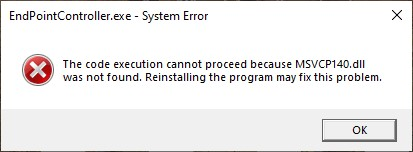
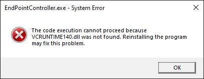

# Switch audio output not available 
!!! info
    From version 1.0.75.0 The MagicPods not longer required The Microsoft Visual C++ 2015 Redistributable

There are two kind errors depended on what version MagicPods you use. MagicPods v.1.0.60.0 and above automatically disable switch audio output. If you use older version you will get this error `msvcp140.dll` or `vcruntime140.dll` not found.

### Solution

1. Installs [Microsoft Visual C++ 2015 Redistributable](https://www.microsoft.com/en-us/download/details.aspx?id=53840)
2. Restart the MagicPods after install Microsoft Visual C++ 2015 Redistributable
3. That's it you can use `Switch audio output` feature now