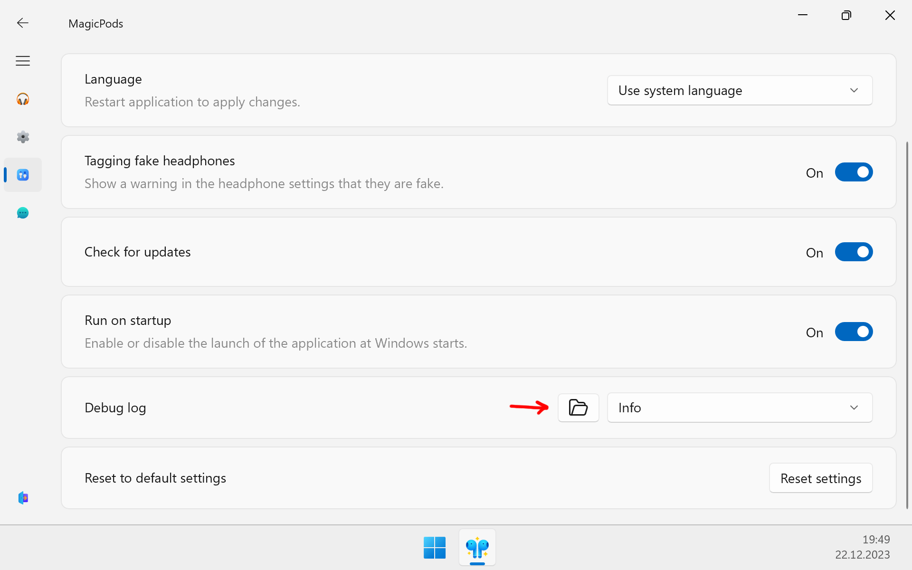

Please see the `Resolving known issues` section, your problem may have already been resolved.

## Self-diagnostics

Most of the problems are related to incorrectly installed Bluetooth driver or corrupted system files. You can easily solve them yourself.

### Update Bluetooth driver

1. Try updating the Bluetooth driver manually. Download the Bluetooth driver from the Bluetooth driver manufacturer's website and install it.
2. Restart the computer

### Check system files

1. Perform file verification according to Microsoft's official instructions [Using System File Checker in Windows](https://support.microsoft.com/en-us/windows/using-system-file-checker-in-windows-365e0031-36b1-6031-f804-8fd86e0ef4ca)
2. Restart the computer

## Report issue

Describe in detail the problem you encountered and the steps to reproduce it. Be sure to upload log files. If possible, add a screenshot or recording of the screen with the problem.

Upload problem description, log files, screenshots and videos to any of those resources:

- Discord

    Join our [Discord](https://discord.com/invite/UyY4PY768V) community. Create a new post in the section [Issue](https://discord.com/channels/1083322534675632188/1083339300223066182) and attach information that you prepared.

- GitHub

    Login or Register on [github.com](https://github.com/) if you don't have an account. Open a new issue on [MagicPods-Windows](https://github.com/steam3d/MagicPods-Windows/issues) and attach information that you prepared. 

- Email

    Attach information that you prepared and send mail to [MagicPods@outlook.com](mailto:MagicPods@outlook.com).

### How to get log files

1. Open the MagicPods, go to the `Preferences` page
2. In the `Debug log` option click to folder icon
3. Add all text files in the opened folder to the ZIP archive

